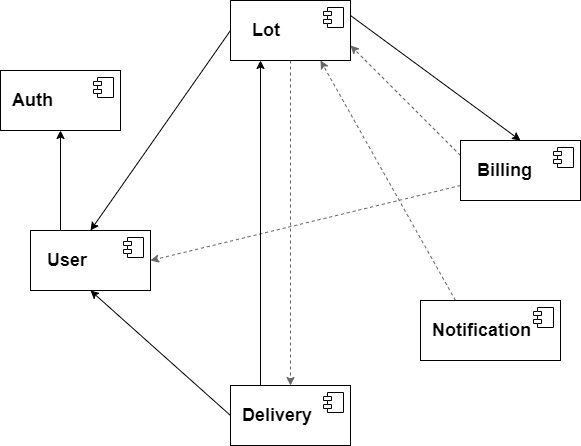

# Пользовательские сценарии
#### Регистрация
Есть неавторизованный пользователь
И есть аукционная площадка
Если пользователь открывает регистрационную форму
То он должен заполнить обязательные поля, а именно
1. Логин
2. Пароль
3. Email
4. Имя Фамилия
5. Адрес

Тогда пользователь зарегистрируется и сможет залогиниться на сайте.  
Далее под пользователем будет подразумеваться авторизованный пользователь.

#### Пополнение баланса
У каждого пользователя есть привязанный к нему счет. После регистрации на счету пользователя 0.  
Пользователь может пополнить счет. После успешного пополнения сумма пополнения прибавится к текущему счету пользователя.

#### Выставление лота на аукцион
Пользователь может выставить лот на аукцион. Для этого ему нужно заполнить поля:
1. Описание лота
2. Стартовая (минимальная) цена
3. Время окончания аукциона
4. (опционально) цена быстрой продажи (ставка равная или выше нее автоматически выигрывает в аукционе)

Тогда этот лот появится в списке доступных лотов у всех остальных пользователей

#### Список лотов
Пользователь может запросить список доступных лотов.
Тогда он получит список, где по каждому лоту будет видно:
1. Описание лота
2. Время окончания
3. Стартовая цена
4. Последняя ставка (при наличии)
5. Цена быстрой продажи (при наличии)
6. Статус
7. Является ли его ставка последней (при наличии ставок)

Пользователь может поискать лоты по описанию.  
Тогда он получит список лотов с искомой информацией в описании.

Пользователь может запросить статус выигранных лотов.  
Тогда помимо обычной информации об этих лотах он увидит их статус (`выигран`, `отправлен`, `получен`).

Пользователь может запросить список лотов, на которые он делал ставки.  
Тогда помимо обычной информации он увидит его ли ставка является последней.

#### Список своих лотов

Пользователь может запросить список своих лотов.  
Тогда он помимо обычной информации увидит список всех ставок на каждый лот.

#### Ставки на лот
Пользователь при просмотре доступного лота может сделать свою ставку.   
Если ставка больше доступных средств на счете пользователя, тогда он получит ошибку.  
Если ставка меньше последней ставки или меньше стартовой цены, тогда он тоже получит ошибку.  
Если ставка больше или равна цене быстрой продажи, тогда лот автоматически становится выигранным, а деньги блокируются на счете.  
Иначе ставка успешно регистрируется, а сумма ставки блокируется на счете

#### Заблокированные средства на счете
Пользователь может запросить состояние своего счета.  
Тогда он увидит сумму доступных средства и сумму заблокированных средств.

Если ставка пользователя перебита другим пользователем, тогда заблокированные на ставку средства возвращаются на счет.

#### Окончание аукциона
Если время лота закончилось, но ставок не было, тогда лот просто закрывается.  
Если были ставки, то лот считается успешно законченным, победителем становится последний, кто сделал ставку.  
Если время лота заканчивается, и кто-то сделал новую ставку, то время окончания лота увеличивается минимум до минуты (с текущего времени).

#### Уведомления
Если ставка пользователя выиграла, была перебита другим пользователем, или изменился статус выигранного лота, то пользователь получает уведомление.

#### Отправка лота
Если добавленный пользователем лот успешно выигран, тогда он должен отправить его победителю.  
После этого он подтверждает отправку (статус лота меняется на `отправлен`).

#### Получение лота
Пользователь, выигравший аукцион, получает отправленный лот. После этого он подтверждает доставку лота.  
Тогда заблокированные средства снимаются и переводятся отправителю (статус лота меняется на `получен`).

# Общая схема взаимодействия сервисов
На схеме:  
* сплошными стрелками обозначено синхронное обращение к другому сервису
* штриховыми стрелками обозначено слежение за событиями другого сервиса

# Описание сервисов

### Сервис "Auth"
#### Название и описание:
Auth. Хранит логины и пароли пользователей (логин, имя, адрес и т.п.) и выступает в роли сервиса аутентификации, то есть ответственен за логинацию пользователей и генерацию Auth-токенов для внутренних запросов.
#### Запросы:
* Аутентификация пользователя  
  GET/POST/PUT/DELETE `/internal/api/v1/auth`

#### Команды:
* Регистрация пользователя  
  POST `/internal/api/v1/register` {login, password}
* Удаление пользователя  
  DELETE `/internal/api/v1/user/{userID}` 
* Логинация пользователя  
  POST `/api/v1/login` {login, password}
* Разлогинация пользователя  
  POST `/api/v1/logout`

#### События:
* \-

#### Зависимости:
* \-

### Сервис "User"
#### Название и описание:
User. Хранит информацию о профилях пользователей (имя, адрес и т.п.), а также ответственен за регистрацию пользователей.
#### Запросы:
* Получение профиля текущего пользователя
  GET `/api/v1/user/profile` {id, login, firstName, lastName, email, address}
* Получение профиля конкретного пользователя
  GET `/internal/api/v1/user/{id}/profile` {...}

#### Команды:
* Регистрация пользователя  
  POST `/api/v1/register` {login, password, firstName, lastName, email, address}
* Изменение профиля пользователя  
  PUT `/api/v1/user/profile` {firstName, lastName, email, address}

#### События:
* Событие о регистрации пользователя `user.user_registered`

#### Зависимости:
* Отправляет синхронные запросы в сервис Auth для регистрации пользователя 

### Сервис "Billing"
#### Название и описание:
Billing. Отвечает за счет пользователя в системе, его пополнение и оплату ставок аукционов.
#### Запросы:
* Получить состояние своего счета  
  GET `/api/v1/account`  {amount, blockedAmount}
#### Команды:
* Пополнить счет  
  POST `/api/v1/account` {amount}
* Оплатить (заблокировать деньги на счету) ставку  
  POST `/internal/api/v1/payment` {userID, amount, lotID}
#### События:
* \-
#### Зависимости:
* Слушает событие регистрации пользователя `user.user_registered` от сервиса User
* Слушает событие о перебитой ставке `lot.bid_outbid` и событие об отмене ставки из-за какой то ошибки `lot.bid_cancelled` от сервиса Lot для возвращения заблокированных ставкой средств на счет
* Слушает событие об успешном получении выигранного лота `lot.lot_received` от сервиса Lot для перевода заблокированных на счете победителя средств на счет владельца лота.

### Сервис "Lot"
#### Название и описание:
Lot. Ответственен за выставленные на аукцион лоты, а также ставки других пользователей на эти лоты.
#### Запросы:
* Информация по конкретному лоту  
  GET `/api/v1/lot/{id}` {description, endTime, startPrice, lastBidAmount, buyItNowPrice, status, lastBidderID}  
  GET `/internal/api/v1/lot/{id}` {...}
* Список всех активных лотов  
  GET `/api/v1/lots` [{...}]  
  Дополнительные параметры для фильтрации списка лотов:
    * Поиск по описанию лотов  
      GET `/api/v1/lots?search=...` [{...}]
    * Список лотов, в которых пользователь принимал участие    
      GET `/api/v1/lots?participation=1` [{...}]
    * Список выигранных лотов    
      GET `/api/v1/lots?win=1` [{...}]
* Список выставленных пользователем лотов  
  GET `/api/v1/lots/my` [{description, endTime, startPrice, buyItNowPrice, status, bids:[{userID, userLogin, amount}]}]
#### Команды:
* Выставление нового лота на аукцион  
  POST `/api/v1/lot` {description, endTime, startPrice, buyItNowPrice}
* Добавление ставки на лот  
  POST `/api/v1/lot/{id}/bid` {amount}
#### События:
* Лот выигран - `lot.lot_won`
* Лот закрыт без ставок по окончании срока - `lot.lot_closed`
* Ставка пользователя на лот перебита новой ставкой `lot.bid_outbid`
* Ставка пользователя отменена из-за какой то ошибки в процессе создания `lot.bid_cancelled`
* Выигранный лот отправлен владельцем `lot.lot_sent`
* Выигранный лот получен победителем аукциона `lot.lot_received`
#### Зависимости:
* Слушает событие об отправке лота `delivery.lot_sent` от сервиса Delivery
* Слушает событие о доставке лота `delivery.lot_received` от сервиса Delivery
* Отправляет синхронные запросы в сервис Billing для оплаты ставок
* Отправляет синхронные запросы в сервис User для получения логинов пользователей, которые делали ставки на лоты текущего пользователя

### Сервис "Delivery"
#### Название и описание:
Delivery. Отвечает за информацию об отправке и доставке успешно завершенных лотов.
#### Запросы:
* Получение информации о доставке лота  
  GET `/api/v1/lot/{id}/delivery` {status, sender: {firstName, lastName}, receiver: {firstName, lastName, address}}
#### Команды:
* Подтверждение отправки лота    
  POST `/api/v1/lot/sent` {lotID, trackingID}
* Подтверждение получения лота    
  POST `/api/v1/lot/received` {lotID}
#### События:
* Лот отправлен владельцем `delivery.lot_sent`
* Лот получен победителем `delivery.lot_received`
#### Зависимости:
* Отправляет синхронные запросы в сервис Lot для получения информации об интересующем лоте
* Отправляет синхронные запросы в сервис User для получения информации о победителе аукциона

### Сервис "Notification"
#### Название и описание:
Notification. Отвечает за уведомления, интересующие пользователей (например, о выигрыше аукциона или перебитой ставке)
#### Запросы:
* Получение списка уведомления пользователя  
  GET `/api/v1/notifications`
#### Команды:
* \-
#### События:
* \-

#### Зависимости:
* Слушает событие о выигрыше аукциона `lot.lot_won` от сервиса Lot
* Слушает событие о закрытии аукциона без ставок `lot.lot_closed` от сервиса Lot
* Слушает событие о перебитой ставке `lot.bid_outbid` от сервиса Lot
* Слушает событие об отправленном лоте `lot.lot_sent` от сервиса Lot
* Слушает событие о доставленном лоте `lot.lot_received` от сервиса Lot
